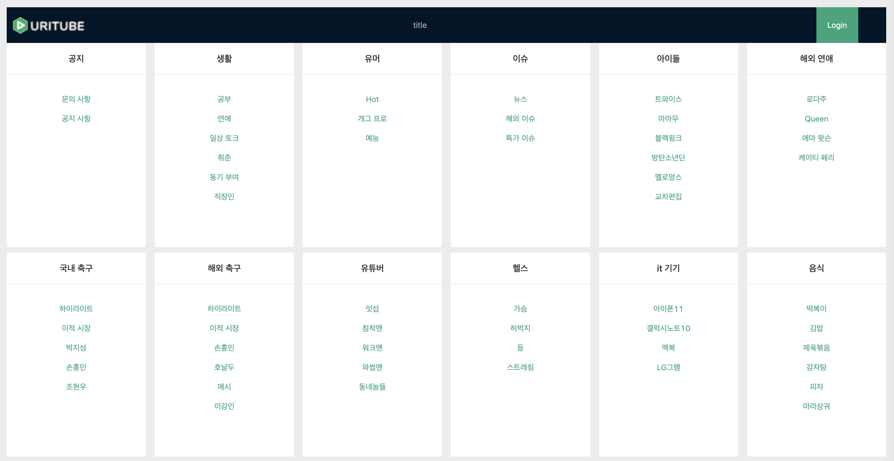

# Uritube
카테고리 별로 유튜브 동영상을 보여주는 커뮤니티 플랫폼



# 앱 실행 화면

### 회원가입


### 로그인 


### 동영상 재생


### 댓글 작성


### admin page


# Front-end Skill
react, react_hooks, antd_desgin

# 설치 방법
```sh
npm install
```

# 업데이트 내역
* 0.1.0
    * 첫 출시
